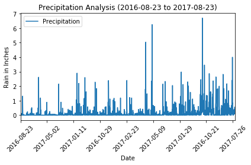
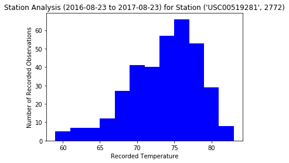
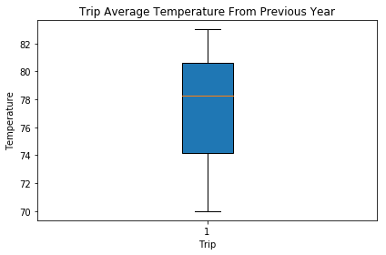

# Climate Analysis and Exploration

## Planning a vacation: climate analysis on the specific area.
 
```python
#Step 3 - Climate Analysis and Exploration
# climate_analysis.ipynb

#dependencies
import pandas as pd
import os
import matplotlib.pyplot as plt
import numpy as np
import sqlalchemy
from sqlalchemy import create_engine
from sqlalchemy.orm import Session
from sqlalchemy.ext.automap import automap_base
from sqlalchemy import create_engine, func
import datetime as dt
```


```python
# Read weather data
df_measurements = pd.read_csv("clean_hawaii_measurements.csv")
df_stations = pd.read_csv("clean_hawaii_stations.csv")
df_stations.head()
```


<div>
<style>
    .dataframe thead tr:only-child th {
        text-align: right;
    }

    .dataframe thead th {
        text-align: left;
    }

    .dataframe tbody tr th {
        vertical-align: top;
    }
</style>
<table border="1" class="dataframe">
  <thead>
    <tr style="text-align: right;">
      <th></th>
      <th>id</th>
      <th>station</th>
      <th>name</th>
      <th>latitude</th>
      <th>longitude</th>
      <th>elevation</th>
    </tr>
  </thead>
  <tbody>
    <tr>
      <th>0</th>
      <td>0</td>
      <td>USC00519397</td>
      <td>WAIKIKI 717.2, HI US</td>
      <td>21.2716</td>
      <td>-157.8168</td>
      <td>3.0</td>
    </tr>
    <tr>
      <th>1</th>
      <td>1</td>
      <td>USC00513117</td>
      <td>KANEOHE 838.1, HI US</td>
      <td>21.4234</td>
      <td>-157.8015</td>
      <td>14.6</td>
    </tr>
    <tr>
      <th>2</th>
      <td>2</td>
      <td>USC00514830</td>
      <td>KUALOA RANCH HEADQUARTERS 886.9, HI US</td>
      <td>21.5213</td>
      <td>-157.8374</td>
      <td>7.0</td>
    </tr>
    <tr>
      <th>3</th>
      <td>3</td>
      <td>USC00517948</td>
      <td>PEARL CITY, HI US</td>
      <td>21.3934</td>
      <td>-157.9751</td>
      <td>11.9</td>
    </tr>
    <tr>
      <th>4</th>
      <td>4</td>
      <td>USC00518838</td>
      <td>UPPER WAHIAWA 874.3, HI US</td>
      <td>21.4992</td>
      <td>-158.0111</td>
      <td>306.6</td>
    </tr>
  </tbody>
</table>
</div>


```python
df_measurements.head()
```


<div>
<style>
    .dataframe thead tr:only-child th {
        text-align: right;
    }

    .dataframe thead th {
        text-align: left;
    }

    .dataframe tbody tr th {
        vertical-align: top;
    }
</style>
<table border="1" class="dataframe">
  <thead>
    <tr style="text-align: right;">
      <th></th>
      <th>id</th>
      <th>station</th>
      <th>date</th>
      <th>prcp</th>
      <th>tobs</th>
    </tr>
  </thead>
  <tbody>
    <tr>
      <th>0</th>
      <td>0</td>
      <td>USC00519397</td>
      <td>2010-01-01</td>
      <td>0.08</td>
      <td>65</td>
    </tr>
    <tr>
      <th>1</th>
      <td>1</td>
      <td>USC00519397</td>
      <td>2010-01-02</td>
      <td>0.00</td>
      <td>63</td>
    </tr>
    <tr>
      <th>2</th>
      <td>2</td>
      <td>USC00519397</td>
      <td>2010-01-03</td>
      <td>0.00</td>
      <td>74</td>
    </tr>
    <tr>
      <th>3</th>
      <td>3</td>
      <td>USC00519397</td>
      <td>2010-01-04</td>
      <td>0.00</td>
      <td>76</td>
    </tr>
    <tr>
      <th>4</th>
      <td>5</td>
      <td>USC00519397</td>
      <td>2010-01-07</td>
      <td>0.06</td>
      <td>70</td>
    </tr>
  </tbody>
</table>
</div>


```python
measurements_data = df_measurements.to_dict(orient='records')
stations_data = df_stations.to_dict(orient='records')
#print(measurements_data)
```

## Use SQLAlchemy create_engine to connect to sqlite database

```python
#Use SQLAlchemy create_engine to connect to your sqlite database.
#Use the engine and connection string to create a database called hawaii.sqlite.
engine = create_engine("sqlite:///hawaii.sqlite")
session = Session(bind=engine)
conn = engine.connect()
```


```python
#Use SQLAlchemy automap_base() to reflect your tables into classes and save a reference to those
#classes called Station and Measurement.
Base = automap_base()
Base.prepare(engine, reflect=True)
Base.classes.keys()
```


    ['measurements', 'stations']


```python
Measurement = Base.classes.measurements
Station = Base.classes.stations
session.query(Station).delete()
session.commit()
```


```python
for station_row in stations_data:
    session.add(Station(**station_row))
session.commit()
```


```python
# Query all tobs values
session.query(Station.station, Station.name, Station.latitude, Station.longitude, Station.elevation).all()
```


    [('USC00519397', 'WAIKIKI 717.2, HI US', 21.2716, -157.8168, 3.0),
     ('USC00513117', 'KANEOHE 838.1, HI US', 21.4234, -157.8015, 14.6),
     ('USC00514830',
      'KUALOA RANCH HEADQUARTERS 886.9, HI US',
      21.5213,
      -157.8374,
      7.0),
     ('USC00517948', 'PEARL CITY, HI US', 21.3934, -157.9751, 11.9),
     ('USC00518838', 'UPPER WAHIAWA 874.3, HI US', 21.4992, -158.0111, 306.6),
     ('USC00519523',
      'WAIMANALO EXPERIMENTAL FARM, HI US',
      21.33556,
      -157.71139,
      19.5),
     ('USC00519281', 'WAIHEE 837.5, HI US', 21.45167, -157.84888999999995, 32.9),
     ('USC00511918', 'HONOLULU OBSERVATORY 702.2, HI US', 21.3152, -157.9992, 0.9),
     ('USC00516128', 'MANOA LYON ARBO 785.2, HI US', 21.3331, -157.8025, 152.4)]


```python
session.query(Measurement).delete()
session.commit()
```


```python
for measurement_row in measurements_data:
    #print(measurement_row)
    dt_year  = int(measurement_row['date'][:4])
    dt_month =  int(measurement_row['date'][5:7])
    dt_day = int(measurement_row['date'][8:10])
    date = dt.date(dt_year, dt_month, dt_day)
    session.add(Measurement(**{
        'id': measurement_row['id'],
        'station': measurement_row['station'],
        'prcp': measurement_row['prcp'],
        'tobs': measurement_row['tobs'],
        'date': date}))
session.commit()
#session.rollback()
```


```python
session.query(Measurement.id, Measurement.station, Measurement.date, Measurement.prcp, Measurement.tobs).limit(5).all()
#engine.execute('SELECT * FROM measurement LIMIT 5').fetchall()
```


    [(0, 'USC00519397', '2010-01-01', 0.08, 65.0),
     (1, 'USC00519397', '2010-01-02', 0.0, 63.0),
     (2, 'USC00519397', '2010-01-03', 0.0, 74.0),
     (3, 'USC00519397', '2010-01-04', 0.0, 76.0),
     (5, 'USC00519397', '2010-01-07', 0.06, 70.0)]


```python
#Choose a start date and end date for your trip. Make sure that your vacation range is approximately
#3-15 days total.
trip_start = dt.date(2017, 8, 15)
trip_end = dt.date(2017, 8, 30)
```

## Precipitation Analysis

```python
### Precipitation Analysis

### # Design a query to retrieve the last 12 months of precipitation data and plot the results
end_date_str = session.query(Measurement.date).order_by(Measurement.date.desc()).first().date
dt_year  = int(end_date_str[:4])
dt_month =  int(end_date_str[5:7])
dt_day = int(end_date_str[8:10])
end_date = dt.date(dt_year, dt_month, dt_day)
start_date = end_date - dt.timedelta(days=365)

print("Start Date: ", start_date)
print("End Date: ", end_date)

#Select only the date and prcp values
measurement_year = session.query(Measurement.date, Measurement.prcp).\
    filter(Measurement.date >= start_date).\
    filter(Measurement.date <= end_date).all()


```

    Start Date:  2016-08-23
    End Date:  2017-08-23
    


```python
#Load the query results into a Pandas DataFrame and set the index to the date column.
precip_stat_df = pd.DataFrame(measurement_year)
#precip_stat_df.set_index('date', inplace=True)
precip_stat_df.head()
```


<div>
<style>
    .dataframe thead tr:only-child th {
        text-align: right;
    }

    .dataframe thead th {
        text-align: left;
    }

    .dataframe tbody tr th {
        vertical-align: top;
    }
</style>
<table border="1" class="dataframe">
  <thead>
    <tr style="text-align: right;">
      <th></th>
      <th>date</th>
      <th>prcp</th>
    </tr>
  </thead>
  <tbody>
    <tr>
      <th>0</th>
      <td>2016-08-23</td>
      <td>0.00</td>
    </tr>
    <tr>
      <th>1</th>
      <td>2016-08-24</td>
      <td>0.08</td>
    </tr>
    <tr>
      <th>2</th>
      <td>2016-08-25</td>
      <td>0.08</td>
    </tr>
    <tr>
      <th>3</th>
      <td>2016-08-26</td>
      <td>0.00</td>
    </tr>
    <tr>
      <th>4</th>
      <td>2016-08-27</td>
      <td>0.00</td>
    </tr>
  </tbody>
</table>
</div>


```python
#Plot the results using the DataFrame plot method.
precip_stat_df.plot('date', 'prcp')
plt.xlabel("Date")
plt.ylabel("Rain in Inches")
plt.title("Precipitation Analysis (2016-08-23 to 2017-08-23)")
plt.legend(["Precipitation"])
plt.xticks(rotation=45)
plt.tight_layout()
plt.show()
```





```python
#Use Pandas to print the summary statistics for the precipitation data.
precip_stat_df.describe()

```


<div>
<style>
    .dataframe thead tr:only-child th {
        text-align: right;
    }

    .dataframe thead th {
        text-align: left;
    }

    .dataframe tbody tr th {
        vertical-align: top;
    }
</style>
<table border="1" class="dataframe">
  <thead>
    <tr style="text-align: right;">
      <th></th>
      <th>prcp</th>
    </tr>
  </thead>
  <tbody>
    <tr>
      <th>count</th>
      <td>2021.000000</td>
    </tr>
    <tr>
      <th>mean</th>
      <td>0.177279</td>
    </tr>
    <tr>
      <th>std</th>
      <td>0.461190</td>
    </tr>
    <tr>
      <th>min</th>
      <td>0.000000</td>
    </tr>
    <tr>
      <th>25%</th>
      <td>0.000000</td>
    </tr>
    <tr>
      <th>50%</th>
      <td>0.020000</td>
    </tr>
    <tr>
      <th>75%</th>
      <td>0.130000</td>
    </tr>
    <tr>
      <th>max</th>
      <td>6.700000</td>
    </tr>
  </tbody>
</table>
</div>


## Station Analysis

```python
#Station Analysis
session.query(Station.id, Station.station, Station.name, Station.latitude, Station.longitude, Station.elevation).all()
```


    [(0, 'USC00519397', 'WAIKIKI 717.2, HI US', 21.2716, -157.8168, 3.0),
     (1, 'USC00513117', 'KANEOHE 838.1, HI US', 21.4234, -157.8015, 14.6),
     (2,
      'USC00514830',
      'KUALOA RANCH HEADQUARTERS 886.9, HI US',
      21.5213,
      -157.8374,
      7.0),
     (3, 'USC00517948', 'PEARL CITY, HI US', 21.3934, -157.9751, 11.9),
     (4, 'USC00518838', 'UPPER WAHIAWA 874.3, HI US', 21.4992, -158.0111, 306.6),
     (5,
      'USC00519523',
      'WAIMANALO EXPERIMENTAL FARM, HI US',
      21.33556,
      -157.71139,
      19.5),
     (6,
      'USC00519281',
      'WAIHEE 837.5, HI US',
      21.45167,
      -157.84888999999995,
      32.9),
     (7,
      'USC00511918',
      'HONOLULU OBSERVATORY 702.2, HI US',
      21.3152,
      -157.9992,
      0.9),
     (8, 'USC00516128', 'MANOA LYON ARBO 785.2, HI US', 21.3331, -157.8025, 152.4)]


```python
#Design a query to calculate the total number of stations.
total_stats = session.query(Measurement).group_by(Measurement.station).count()
print("There are {} stations.".format(total_stats))
```

    There are 9 stations.
    


```python
#Design a query to find the most active stations.
most_active_stats= session.query(Measurement.station, func.count(Measurement.station)).\
        group_by(Measurement.station).order_by(func.count(Measurement.station).desc()).all()

# Set above query results to dataframe
df_most_active_stats = pd.DataFrame(data=most_active_stats, columns=['Station', 'Count'])
df_most_active_stats.head()
```


<div>
<style>
    .dataframe thead tr:only-child th {
        text-align: right;
    }

    .dataframe thead th {
        text-align: left;
    }

    .dataframe tbody tr th {
        vertical-align: top;
    }
</style>
<table border="1" class="dataframe">
  <thead>
    <tr style="text-align: right;">
      <th></th>
      <th>Station</th>
      <th>Count</th>
    </tr>
  </thead>
  <tbody>
    <tr>
      <th>0</th>
      <td>USC00519281</td>
      <td>2772</td>
    </tr>
    <tr>
      <th>1</th>
      <td>USC00513117</td>
      <td>2696</td>
    </tr>
    <tr>
      <th>2</th>
      <td>USC00519397</td>
      <td>2685</td>
    </tr>
    <tr>
      <th>3</th>
      <td>USC00519523</td>
      <td>2572</td>
    </tr>
    <tr>
      <th>4</th>
      <td>USC00516128</td>
      <td>2484</td>
    </tr>
  </tbody>
</table>
</div>


```python
#List the stations and observation counts in descending order
desc_observations=session.query(Measurement.station, func.count(Measurement.id)).\
        group_by(Measurement.station).\
        order_by(func.count(Measurement.id).desc()).all()  
desc_observations
```


    [('USC00519281', 2772),
     ('USC00513117', 2696),
     ('USC00519397', 2685),
     ('USC00519523', 2572),
     ('USC00516128', 2484),
     ('USC00514830', 1937),
     ('USC00511918', 1932),
     ('USC00517948', 683),
     ('USC00518838', 342)]


```python
#Which station has the highest number of observations?
highest_observation=session.query(Measurement.station, func.count(Measurement.id)).\
        group_by(Measurement.station).\
        order_by(func.count(Measurement.id).desc()).first() 
print(f"The station with the highest number of observations is {highest_observation}")
```

    The station with the highest number of observations is ('USC00519281', 2772)
    


```python
#Design a query to retrieve the last 12 months of temperature observation data (tobs).
tobs_measurement_year = session.query(Measurement.date, Measurement.station, Measurement.tobs).\
    filter(Measurement.date >= start_date).\
    filter(Measurement.date <= end_date).all()
    #Load the query results into a Pandas DataFrame and set the index to the date column.
tobs_stat_df = pd.DataFrame(tobs_measurement_year)
#tobs_stat_df.set_index('date', inplace=True)
tobs_stat_df.head()
```


<div>
<style>
    .dataframe thead tr:only-child th {
        text-align: right;
    }

    .dataframe thead th {
        text-align: left;
    }

    .dataframe tbody tr th {
        vertical-align: top;
    }
</style>
<table border="1" class="dataframe">
  <thead>
    <tr style="text-align: right;">
      <th></th>
      <th>date</th>
      <th>station</th>
      <th>tobs</th>
    </tr>
  </thead>
  <tbody>
    <tr>
      <th>0</th>
      <td>2016-08-23</td>
      <td>USC00519397</td>
      <td>81.0</td>
    </tr>
    <tr>
      <th>1</th>
      <td>2016-08-24</td>
      <td>USC00519397</td>
      <td>79.0</td>
    </tr>
    <tr>
      <th>2</th>
      <td>2016-08-25</td>
      <td>USC00519397</td>
      <td>80.0</td>
    </tr>
    <tr>
      <th>3</th>
      <td>2016-08-26</td>
      <td>USC00519397</td>
      <td>79.0</td>
    </tr>
    <tr>
      <th>4</th>
      <td>2016-08-27</td>
      <td>USC00519397</td>
      <td>77.0</td>
    </tr>
  </tbody>
</table>
</div>


```python
#Filter by the station with the highest number of observations.
tobs_for_12months = session.query(Measurement.tobs).\
    filter(Measurement.date >= start_date).\
    filter(Measurement.station == highest_observation[0]).\
    order_by(Measurement.tobs).all()
    
tobs_for_12months
```


    [(59.0),
     (59.0),
     (59.0),
     (60.0),
     (60.0),
     (61.0),
     (62.0),
     (62.0),
     (62.0),
     (62.0),
     (62.0),
     (62.0),
     (63.0),
     (63.0),
     (63.0),
     (63.0),
     (64.0),
     (64.0),
     (64.0),
     (65.0),
     (65.0),
     (65.0),
     (65.0),
     (65.0),
     (65.0),
     (65.0),
     (66.0),
     (66.0),
     (66.0),
     (66.0),
     (66.0),
     (67.0),
     (67.0),
     (67.0),
     (67.0),
     (67.0),
     (67.0),
     (67.0),
     (67.0),
     (67.0),
     (67.0),
     (67.0),
     (67.0),
     (67.0),
     (67.0),
     (67.0),
     (68.0),
     (68.0),
     (68.0),
     (68.0),
     (68.0),
     (68.0),
     (68.0),
     (68.0),
     (68.0),
     (68.0),
     (68.0),
     (68.0),
     (69.0),
     (69.0),
     (69.0),
     (69.0),
     (69.0),
     (69.0),
     (69.0),
     (69.0),
     (69.0),
     (69.0),
     (69.0),
     (69.0),
     (69.0),
     (69.0),
     (69.0),
     (69.0),
     (69.0),
     (69.0),
     (69.0),
     (70.0),
     (70.0),
     (70.0),
     (70.0),
     (70.0),
     (70.0),
     (70.0),
     (70.0),
     (70.0),
     (70.0),
     (70.0),
     (70.0),
     (70.0),
     (70.0),
     (70.0),
     (70.0),
     (70.0),
     (70.0),
     (70.0),
     (70.0),
     (70.0),
     (70.0),
     (71.0),
     (71.0),
     (71.0),
     (71.0),
     (71.0),
     (71.0),
     (71.0),
     (71.0),
     (71.0),
     (71.0),
     (71.0),
     (71.0),
     (71.0),
     (71.0),
     (71.0),
     (71.0),
     (71.0),
     (71.0),
     (72.0),
     (72.0),
     (72.0),
     (72.0),
     (72.0),
     (72.0),
     (72.0),
     (72.0),
     (72.0),
     (72.0),
     (72.0),
     (72.0),
     (72.0),
     (72.0),
     (72.0),
     (72.0),
     (72.0),
     (72.0),
     (72.0),
     (72.0),
     (72.0),
     (72.0),
     (73.0),
     (73.0),
     (73.0),
     (73.0),
     (73.0),
     (73.0),
     (73.0),
     (73.0),
     (73.0),
     (73.0),
     (73.0),
     (73.0),
     (73.0),
     (73.0),
     (73.0),
     (73.0),
     (73.0),
     (73.0),
     (74.0),
     (74.0),
     (74.0),
     (74.0),
     (74.0),
     (74.0),
     (74.0),
     (74.0),
     (74.0),
     (74.0),
     (74.0),
     (74.0),
     (74.0),
     (74.0),
     (74.0),
     (74.0),
     (74.0),
     (74.0),
     (74.0),
     (74.0),
     (74.0),
     (74.0),
     (74.0),
     (74.0),
     (74.0),
     (74.0),
     (74.0),
     (74.0),
     (74.0),
     (74.0),
     (74.0),
     (74.0),
     (74.0),
     (74.0),
     (74.0),
     (74.0),
     (74.0),
     (74.0),
     (74.0),
     (75.0),
     (75.0),
     (75.0),
     (75.0),
     (75.0),
     (75.0),
     (75.0),
     (75.0),
     (75.0),
     (75.0),
     (75.0),
     (75.0),
     (75.0),
     (75.0),
     (75.0),
     (75.0),
     (75.0),
     (75.0),
     (75.0),
     (75.0),
     (75.0),
     (75.0),
     (75.0),
     (75.0),
     (75.0),
     (75.0),
     (75.0),
     (75.0),
     (75.0),
     (75.0),
     (75.0),
     (75.0),
     (75.0),
     (76.0),
     (76.0),
     (76.0),
     (76.0),
     (76.0),
     (76.0),
     (76.0),
     (76.0),
     (76.0),
     (76.0),
     (76.0),
     (76.0),
     (76.0),
     (76.0),
     (76.0),
     (76.0),
     (76.0),
     (76.0),
     (76.0),
     (76.0),
     (76.0),
     (76.0),
     (76.0),
     (76.0),
     (76.0),
     (76.0),
     (76.0),
     (76.0),
     (76.0),
     (76.0),
     (76.0),
     (76.0),
     (76.0),
     (77.0),
     (77.0),
     (77.0),
     (77.0),
     (77.0),
     (77.0),
     (77.0),
     (77.0),
     (77.0),
     (77.0),
     (77.0),
     (77.0),
     (77.0),
     (77.0),
     (77.0),
     (77.0),
     (77.0),
     (77.0),
     (77.0),
     (77.0),
     (77.0),
     (77.0),
     (77.0),
     (77.0),
     (77.0),
     (77.0),
     (77.0),
     (77.0),
     (77.0),
     (77.0),
     (77.0),
     (78.0),
     (78.0),
     (78.0),
     (78.0),
     (78.0),
     (78.0),
     (78.0),
     (78.0),
     (78.0),
     (78.0),
     (78.0),
     (78.0),
     (78.0),
     (78.0),
     (78.0),
     (78.0),
     (78.0),
     (78.0),
     (78.0),
     (78.0),
     (78.0),
     (78.0),
     (79.0),
     (79.0),
     (79.0),
     (79.0),
     (79.0),
     (79.0),
     (79.0),
     (79.0),
     (79.0),
     (79.0),
     (79.0),
     (79.0),
     (79.0),
     (79.0),
     (79.0),
     (79.0),
     (79.0),
     (79.0),
     (80.0),
     (80.0),
     (80.0),
     (80.0),
     (80.0),
     (80.0),
     (80.0),
     (80.0),
     (80.0),
     (80.0),
     (80.0),
     (81.0),
     (81.0),
     (81.0),
     (81.0),
     (82.0),
     (82.0),
     (82.0),
     (83.0)]


```python
#Plot the results as a histogram with bins=12.
hist, bins = np.histogram(tobs_for_12months, bins=12)

# Set bar width to the number of values between each bin
width = bins[1] - bins[0]
center = (bins[:-1] + bins[1:]) / 2
# Plot the bar graph from the histogram data
plt.bar(center, hist, width=width, color='blue')
plt.xlabel("Recorded Temperature")
plt.ylabel("Number of Recorded Observations")
plt.title("Station Analysis (2016-08-23 to 2017-08-23) for Station " + str(highest_observation))
plt.show()
```





## Temperature Analysis
```python
# Temperature Analysis
#Write a function called calc_temps that will accept a start date and end date in the format %Y-%m-%d
#and return the minimum, average, and maximum temperatures for that range of dates.
def calc_temps(start_date, end_date):
     return session.query(func.min(Measurement.tobs), func.avg(Measurement.tobs), func.max(Measurement.tobs)).\
        filter(Measurement.date >= start_date).filter(Measurement.date <= end_date).all()
temp_range = (calc_temps('2017-08-15', '2017-08-30'))
print(temp_range)
```

    [(70.0, 78.29032258064517, 83.0)]
    


```python
#Use the calc_temps function to calculate the min, avg, and max temperatures for your trip
#using the matching dates from the previous year (i.e. use "2017-01-01" if your trip start date was "2018-01-01")
my_trip_start = dt.date(2018, 8, 15)
my_trip_end = dt.date(2018, 8, 30)
prev_year = dt.timedelta(days=365)
temp_range = (calc_temps(my_trip_start-prev_year, my_trip_end-prev_year))
print(temp_range)
```

    [(70.0, 78.29032258064517, 83.0)]
    


```python
#Plot the min, avg, and max temperature from your previous query as a bar chart.
#Use the average temperature as the bar height.
#Use the peak-to-peak (tmax-tmin) value as the y error bar (yerr).
fig, ax = plt.subplots()
x = range(len(temp_range))
ax.boxplot(temp_range, patch_artist=True)
ax.set_title('Trip Average Temperature From Previous Year')
ax.set_ylabel("Temperature")
ax.set_xlabel("Trip")
fig.tight_layout()
plt.show()
```




